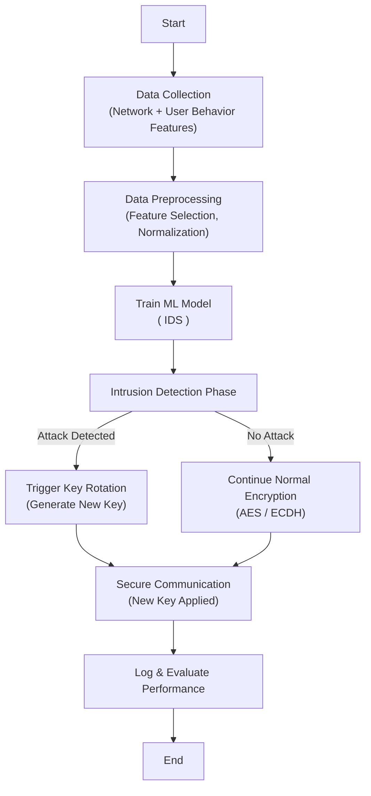

### Adaptive Cryptographic Key Management using Machine Learning-based Intrusion Detection

```mermaid

flowchart TD
    A["Start"] --> B["Data Collection<br>(Network + User Behavior Features)"]
    B --> C["Data Preprocessing<br>(Feature Selection, Normalization)"]
    C --> D["Train ML Model<br>( IDS )"]
    D --> E["Intrusion Detection Phase"]

    E -->|No Attack| F["Continue Normal Encryption<br>(AES / ECDH)"]
    E -->|Attack Detected| G["Trigger Key Rotation<br>(Generate New Key)"]

    G --> H["Secure Communication<br>(New Key Applied)"]
    F --> H
    H --> I["Log & Evaluate Performance"]
    I --> J["End"]


```
