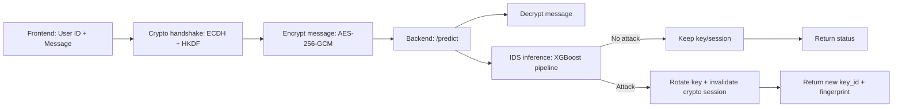

## System Architecture of Adaptive Cryptographic Key Management using Machine Learning-based Intrusion Detection

This project is a working demo that combines:
- **ML-based Intrusion Detection (IDS)** (XGBoost pipeline trained on the included dataset)
- **Adaptive key rotation** when an attack is detected
- **Application-layer secure messaging demo** using **ECDH (P-256) + HKDF + AES-256-GCM**

### High-level flow



### Implemented backend endpoints

- **`GET /health`**: service health + current key id/fingerprint
- **`GET /schema`**: returns valid categorical choices learned from the dataset (used by frontend to generate realistic demo inputs)
- **`POST /handshake`**: ECDH (P-256) handshake; derives an AES key via HKDF and returns `session_id`
- **`POST /predict`**: decrypts encrypted message (if provided), runs IDS inference, rotates key on intrusion
- **`POST /rotate-key`**: manual key rotation (demo)

> Note: Fingerprints are **hash-based** (SHA-256) and do not reveal secret key bytes.

### Folder Structure (current)

```bash
AdaptiveKeyShield-/
├── docs/
│   ├── flowchart.md
│   ├── system_architecture.md
│   └── commands.md
├── backend/
│   ├── app.py                       # Flask API: /schema, /handshake, /predict, key rotation
│   ├── train_ids_pipeline.py        # Trains & saves fitted ML pipeline
│   ├── requirements.txt             # Backend dependencies
│   ├── crypto/                      # (kept for organization; crypto is currently in app.py)
│   └── model/
│       ├── cybersecurity_intrusion_data.csv
│       ├── be_project.ipynb
│       ├── ids_pipeline.joblib      # Saved fitted pipeline (preprocess + XGBoost)
│       ├── xgboost_model.pkl        # Older artifact (kept from notebook)
│       └── scaler.pkl               # Older artifact (kept from notebook)
└── frontend/
    ├── src/
    │   ├── App.jsx                  # Login → Welcome view flow + schema fetch
    │   ├── main.jsx                 # React entry
    │   ├── index.css                # Tailwind import
    │   └── components/
    │       ├── LoginForm.jsx        # Generates demo feature vector, encrypts message, calls /predict
    │       └── BackgroundPanel.jsx  # Marketing/info panel
    ├── package.json
    └── vite.config.js
```

### Configuration notes

- Frontend uses `VITE_API_BASE_URL` (optional) to point to the backend.
  - Default: `http://127.0.0.1:5000`

